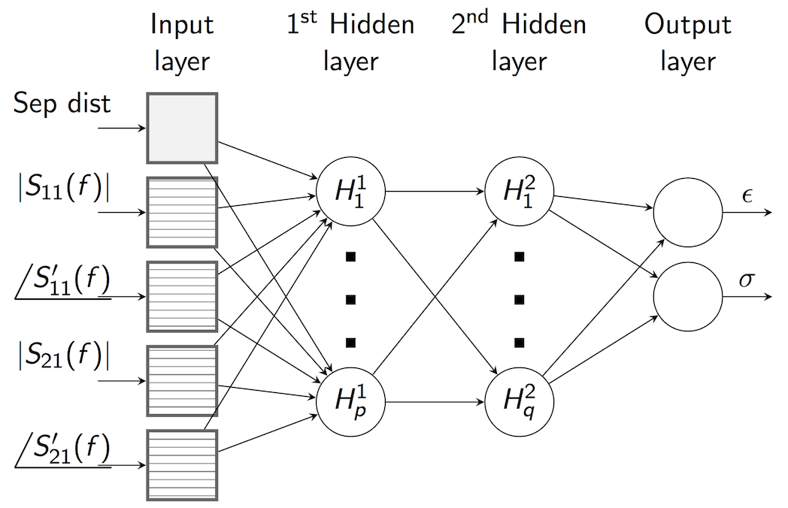

.. dp_ml documentation master file, created by
   sphinx-quickstart on Tue Dec 12 09:58:51 2017.
   You can adapt this file completely to your liking, but it should at least
   contain the root `toctree` directive.

background
=================================

.. image:: figures/dp_ml_logo.png
   :align: center

The dp_ml package uses a few forms of machine learning to develop models for property estimation.
Namely, neural networks and elastic net regression.
We also use different algorithms for processing the raw data prior to generating the models, such as wavelet decomposition and peaks analysis.

This document will describe some of the underlying math.
It may be best to read this document prior to the Tutorial document, in order to better understand the steps it takes.

simulations
-------------------

We use finite difference time domain (FDTD) simulations to generate our training data.
Our training configuration consists of two cylindrical waveguides separated by the tissue under test.
If desired, you can simulate a different configuration (see the Tutorial section).
We simulate over a broad band of frequency: 2-12 GHz.
The resulting scattering parameters can be represented in both the time domain and frequency domain.

.. figure:: figures/WaveguideDiagram.png
   :align: center
   :scale: 60

   Our simulation configuration, as performed using Sim4Life

electromagnetic theory
----------------------

The wave propagation can be represented as a uniform plane wave.

$$ \\alpha = \\omega \\sqrt{\\frac{\\mu \\epsilon}{2} \\bigg[ \\sqrt{1 + [\\frac{\\sigma}{\\omega \\epsilon}]^2 } -1 \\bigg] } $$
$$ \\beta = \\omega \\sqrt{\\frac{\\mu \\epsilon}{2} \\bigg[ \\sqrt{1 + [\\frac{\\sigma}{\\omega \\epsilon}]^2 } + 1 \\bigg] } $$

The reflections can be determined by the intrinsic impedance of each medium, where:

$$ \\eta_{tiss} = \\sqrt{\\frac{j \\omega \\mu}{\\sigma + j \\omega \\epsilon}} $$

Next, the transmission coefficient at each interface can be found as:

$$ T = \\frac{2 \\eta_2}{\\eta_2 + \\eta_1} $$

data preprocessing
------------------

Different forms of processing can be applied to the data prior to model generation.
The simplest may be simply determining the peak the transmitted time domain pulse.
This is an efficient form of data storage, as a large time domain signal (~5000 samples) can be reduced to a simple two-element array (magnitude and time of the maxima).

machine learning
-----------------

neural networks
```````````````




elastic net regression
```````````````````````


