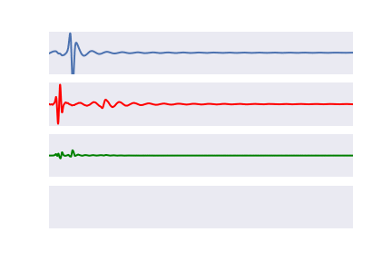
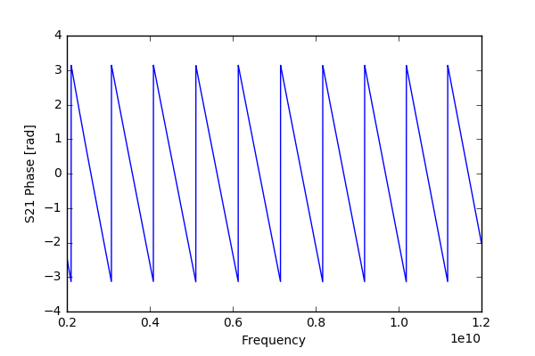
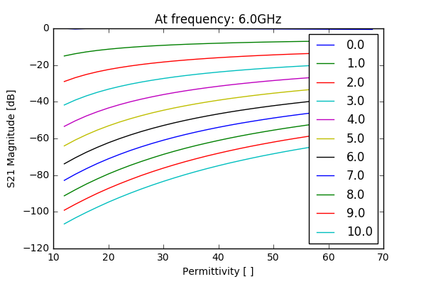
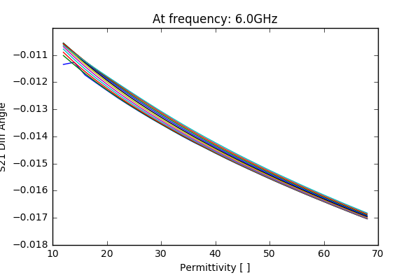

.. dp_ml documentation master file, created by
   sphinx-quickstart on Tue Dec 12 09:58:51 2017.
   You can adapt this file completely to your liking, but it should at least
   contain the root `toctree` directive.

preprocessing
=================================


In assessing the reflected and transmitted signals, we record everything we can: generally thousands of frequency points, which corresponds to thousands of points in the time domain.
Might there be a better way to represent these signals?
Different forms of processing can be applied to the data prior to model generation.
From the very sparse basis of the frequency and time domains, this may allow us to create a more dense and more meaningful space from which to learn.

We are seeking functions which can map the high-dimensional measurement space (denoted :math:`\mathbf{X}`) to low-dimensional but informative dense spaces.
Ultimately dielectric properties are the low-dimensional space we seek to estimate, whether as bulk estimates or in terms of Debye parameters.
However, it can be much more efficient to train our methods using intermediate features (denoted :math:`\vec{Y}`).
These intermediate features can also exploit physical characteristics of the material, allowing for much of the learning process to be human-understandable.
A few methods for this function :math:`f` will be shown below.

.. math ::
	f:\mathbf{X} \rightarrow \vec{Y} 


peak detection
````````````````
A simple method is determining the peak of the reflected and transmitted time domain pulses.
This is an efficient form of data storage, as a large time domain signal (~5000 samples) can be reduced to a simple two-element array (magnitude and time of the maxima) per S-parameter.
We use the pulse envelope in the time domain to do this.

$$ f: \\mathbf{X} \\rightarrow [\\vec{t_{peak}}, \\lvert \\vec{s_{peak}}\\rvert] $$

In the transmitted signal, the time of arrival relates to the permittivity of a material and its magnitude relates with the conductivity.
In the reflected signal, the dominant reflection will generally be at the antenna interface, and the magnitude relates to the mismatch between the antenna and tissue impedances.
Rather than simply considering the greatest peak, we could also consider the :math:`k` dominant peaks. 
This may be useful for instance in layered media where multiple reflections occur, or in complex geometries where there may be multiple transmission paths.


energy analysis
````````````````
Transmitted and reflected energy may be useful information for inferring both about the loss of a material and the reflections which occur inside it and at the antenna aperture.

$$ f: \\mathbf{X} \\rightarrow [E_{refl}, E_{trans}] $$

This function has a convenient analytical form, and can be done both in the time and frequency domain (equivalently, according to Parseval's theorem):

$$ E_{ij} = \\int_{- \\infty}^ \\infty \\lvert \\mathbf{X}_{ij}(t) \\rvert ^2 dt = \\int_{-\\infty}^\\infty \\lvert \\mathbf{X}_{ij}(2\\pi f) \\rvert ^2 df $$

wavelet analysis
`````````````````

The shape of the reflected and transmitted pulse can be quite complex.
If there are overlapping reflections and signal paths, it can be difficult to discern useful information from simple peaks analysis.
Here we aim to use wavelet analysis to extract more informative features.

We use the inner product between the signal and the wavelet to highlight characteristic shapes within the signal.
A conventional inner product for two continuous functions which meet the :math:`L^2` criteria is:

$$ \\langle f(t), w(t) \\rangle = \\int_a^b f(t)w(t) dt $$

where :math:`f(t)` is the signal of interest (e.g. a specific time-domain transmission signal for given properties), and :math:`w(t)` is a mother wavelet.

Since digital signals are inherently discrete, this can also be expressed as:

$$ \\langle f, w \\rangle = \\sum_{n=0}^{n=N} f[n] w[n] $$

where :math:`N` is the number of time steps, and :math:`n` is the current time sample.
By shifting the mother wavelet along in the time domain axis and performing this inner product at each step, we can determine the times where the signal of interest best "aligns" with the mother wavelet.
This may correspond to times of dominant transmissions and reflections in otherwise noisy signals.

For the Mother wavelet, we use the Thru configuration for transmission signals, and the Reflect configuration for reflection signals.
These should provide the "fingerprint" of ideal transmission and reflection.
Similar patterns may then be extracted from more complex scenarios. 

An example of how this wavelet transform is shown below.



Here we propose applying this wavelet transform, then applying the other preprocessing methods such as peaks analysis. 
This may provide a clearer starting point in complex scenarios.


frequency domain analysis
````````````````````````````
We record S-parameters in the frequency domain, where many frequency points are recorded independently.
If we would like to also estimate dielectric properties independently at each frequency, we could use these parameters as our features for the machine learning algorithms.
While these methods do not decrease the dimensionality of the extracted data, they make it more conducive to training the machine learning algorithms.

Extracted data suffers from phase wrapping, since phase is bound by :math:`-\pi < \phi < \pi` as shown below.
The differentiated phase (with respect to frequency) is thus considered.
This is also physically representative of the group velocity, which in turn is related to :math:`\sqrt{\epsilon}`.



An example of the magnitude and phase of the transmission coefficient with varying permittivity (x axis) and conductivity (separate curves) is shown below.
It can be seen that the magnitude of the transmission coefficient is affected both by permittivity and conductivity, but primarily by conductivity.
The differentiated phase of the transmission coefficient, however, is dominated by the permittivity.
This makes intuitive sense since the permittivity dominates the signal speed within the tissue.






In order to model the physical behaviour of the interactions - e.g. attenuation and phase coefficients - the extracted features (magnitude/differentiated phase of S-parameters) are expanded. 
The following feature expansions are performed, in order to account for physical relationships and some potential antenna behaviour which is not modeled analytically:

  - Squared values
  - Square root of values 
  - Exponential of values

Training data from the grid of simulations is then used to obtain estimator models for both permittivity and conductivity at each frequency point from the feature-expanded data. 
The resulting model coefficients can tell us about the dominant predictors of each parameter. 
For instance, permittivity estimation is dominated by the transmission coefficient phase, and conductivity estimation is dominated by the transmission coefficient magnitude.

